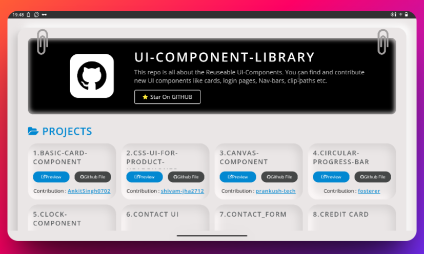
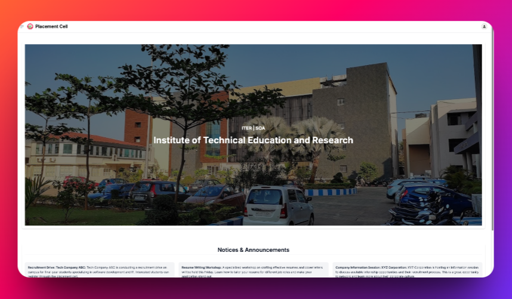
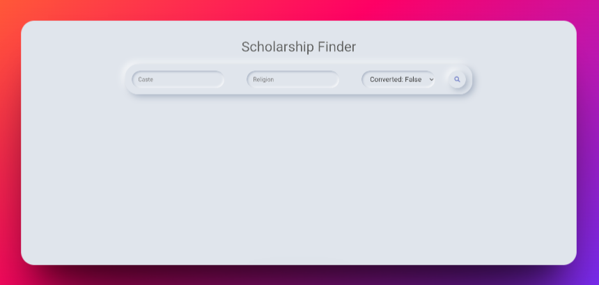

# The Sanjay Times — Professional Profile Portfolio

[](https://www.rust-lang.org/)
[](https://yew.rs/)
[](https://trunkrs.dev/)
[](https://tailwindcss.com/)

An interactive, high-fidelity portfolio styled as a classic vintage newspaper called **"The Sanjay Times"**. Built using **Rust**, **Yew** (WebAssembly), **Stylist**, and **Tailwind CSS**, this portfolio showcases the professional journey, academic credentials, and project highlights of **Sanjay N**, an AI & Full-Stack Engineer.



---

## Professional Background & Profile

Sanjay N is a B.Tech graduate in **Artificial Intelligence & Machine Learning** from **SNS College of Technology** (CGPA: 8.38/10). Over the last three years, he has specialized in developing agentic AI systems, RAG (Retrieval-Augmented Generation) pipelines, and robust full-stack web applications. 



### Key Strengths
- **Agentic AI Orchestrations:** Designing multi-agent communication networks using frameworks like LangChain, LangGraph, CrewAI, and AutoGen.
- **Full-Stack Development:** Building highly responsive, scalable interfaces (React.js, Yew, WebAssembly) backed by efficient service APIs (Python, Node.js, FastAPI).
- **Quality Assurance & Testing:** Automating verification loops to cut deployment-stage faults and API errors by up to 30%.

---

## The Tech Stack

### Languages & Frameworks
* **Languages:** Python, TypeScript, JavaScript, Rust, SQL, C#, Java (Basics)
* **AI/ML & Agentic:** LangChain, LangGraph, CrewAI, AutoGen, PyTorch, TensorFlow, Scikit-Learn
* **Web Stacks:** Yew (Rust Wasm), React.js, Node.js, HTML5/CSS3 (Tailwind CSS, Stylist)
* **Databases & Tools:** SQL, Git, Trunk, Postman, OpenCV, NumPy, Pandas

---

## Featured Projects & Research

### 1. **Agentium**
* **Role:** Lead Architect & Developer
* **Stack:** Python, LangChain, CrewAI
* **Description:** A modular, high-efficiency Python library built to structure multi-agent communications and minimize integration overhead. Reduces agent interface setup time by **55%**.

### 2. **Researcher AgentX**
* **Role:** ML Developer
* **Stack:** Python, AutoGen, LangGraph
* **Description:** An autonomous literature retrieval pipeline that crawls academic portal indexes, evaluates relevancy, structures markdown summaries, and lifts research collection speeds by **18%**.

### 3. **AI Exam Paper Analyzer**
* **Role:** Full-Stack AI Developer
* **Stack:** Python, PyTorch, LangChain, Yew
* **Description:** An intelligent visual pipeline that extracts, parses, and scores hand-written exam answers against grading rubrics, decreasing manual scoring durations by **30%**.

### 4. **Project Management Agent**
* **Role:** Automation Specialist
* **Stack:** Node.js, CrewAI, Slack & Calendar APIs
* **Description:** Coordinates task trackers, calendars, and team updates automatically, boosting productivity metrics by **40%**.

---

## Industry Experience

* **Nexus Horizon** *(Sep 2025 – Apr 2026)* — **AI Developer & Tester**
  * Oversaw the deployment of Faculties.ai, optimizing academic workflow latency and cutting API response error counts by 30%.
* **SNS Square** *(Aug 2024 – Sep 2025)* — **Full Stack AI Developer & Tester**
  * Engineered three web platforms (AI Exam Analyzer, Gen AI Suite, and Aggregator), achieving a 15% increase in scoring accuracy.
* **Cognifyz Technologies** *(Oct 2023 – Jun 2024)* — **AIML Engineer**
  * Constructed recommendation models, fraud-detection loops, and customized RAG chatbots (*Electro Bot* & *Collexa.ai*).

---

## Certifications & Badges
* **Salesforce AI Associate** & **Agentforce Specialist**
* **Oracle Cloud Infrastructure (OCI) AI Foundations Associate**
* **Postman AI Student Expert**
* **NASSCOM Digital Edge (81%)**



---

## How to Build & Run Locally

To launch **The Sanjay Times** portfolio on your local machine, ensure you have Rust and Trunk installed.

### Prerequisites
1. **Rust Toolchain:**
   ```bash
   curl --proto '=https' --tlsv1.2 -sSf https://sh.rustup.rs | sh
   ```
2. **WebAssembly Target:**
   ```bash
   rustup target add wasm32-unknown-unknown
   ```
3. **Trunk Compiler:**
   ```bash
   cargo install --locked trunk
   ```

### Running the App
1. Clone the repository and navigate to the directory:
   ```bash
   cd RNS_Professional_Profile
   ```
2. Start the Trunk development server:
   ```bash
   trunk serve
   ```
3. Open your browser to: `http://localhost:8080`
